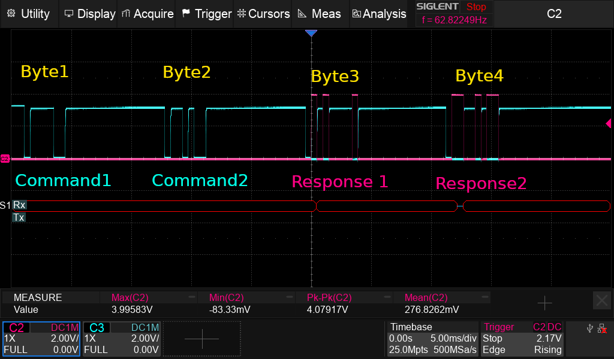
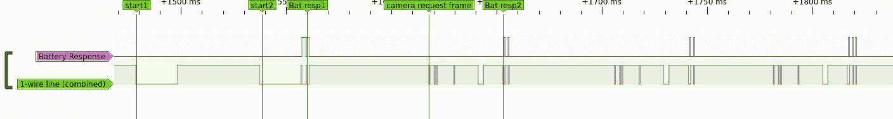

# openlithium (work in progress)
Reverse engineering Sony's obsolete InfoLithium protocol for a 23 year old Camcorder

The protocol describes the communcation on a propietary 1-wire
interface. Between camcorder and Battery is a 1-wire line. 3V HIGH is the
default state, 0.2V means logic level LOW.  Any partner who wants to
communicates, pulls the line to LOW.

The Camcorder initiates the communication by sending a preamble with 2
big LOW pulses with a width of 16ms-20ms. I have conflicting
measurements.  Another LOW pulse with a similar width follows. This is
believed to wake up the micro controller in the battery.

Then a never ending stream of communication starts: The Camera keeps
sending frames consisting of 4 Data-Words to the battery controller. The first two words,
contain binary data, probably command words. The next two bytes that
are sent only have their start bit pulled down. The battery controller is
supposed to sync up to the start bit of these "empty bytes" and pull down the 1-wire bus to
"fill-up" the byte, in order to send out its response in an orderly
manner to the camera

| COMMAND1 | COMMAND2 | RESP1 | RESP2 |

Below is the annotated sequence of the 1-wire communication. The first
channel shows the responses of the battery controller, the 2nd channel
displays the 1-wire link that combines camera requests and the battery responses

On my battery, an atmega 48pa, sends its synced responses over
Pin 25. An unknown SOP23 transistor marked with Q1 on the silk screen,
takes this digital signal and uses it to pull down the 1-wire line,
hence inverting the logic levels. The 1-wire line is conected over a
?buffered? input to PIN26 of the ATMEGA, where the mcu may read the signals.

There is a very old discussion in this dpreview thread from 2001

Another Post with comments from 2001:
http://www.bealecorner.com/trv900/battery/lithium.html
https://archive.ph/sEuQF

This could be us:

Soon I'll have an idea how this works...
